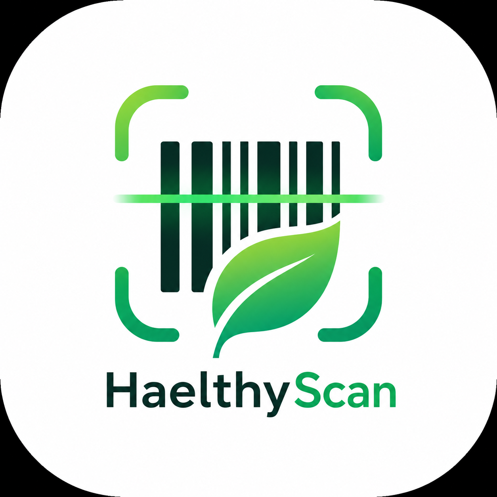
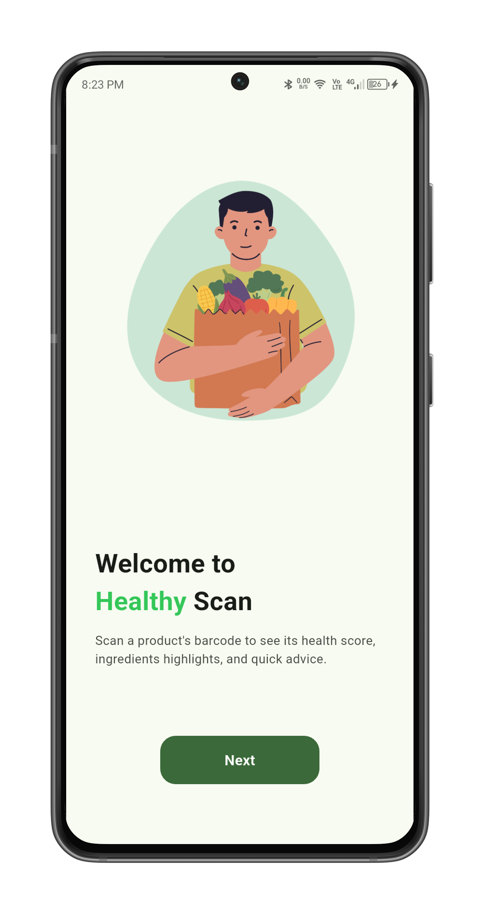
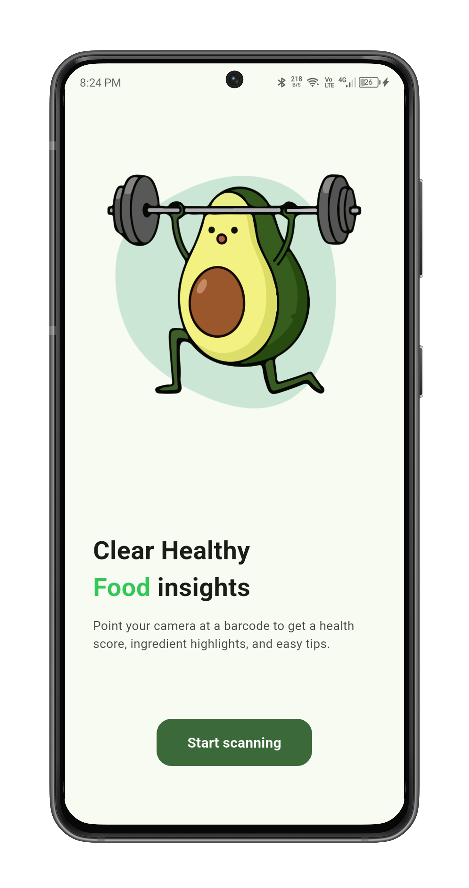
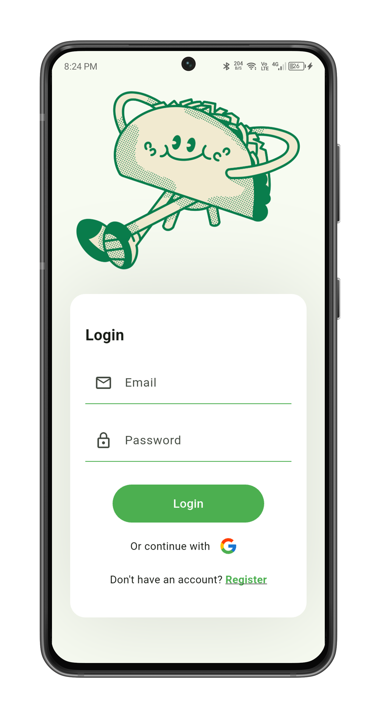
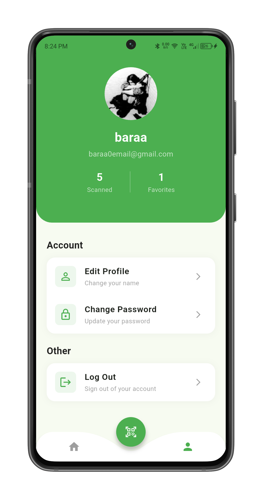
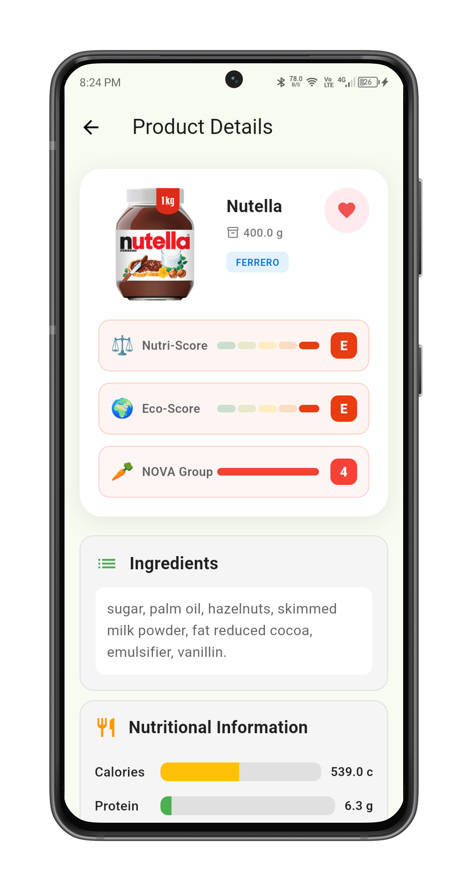
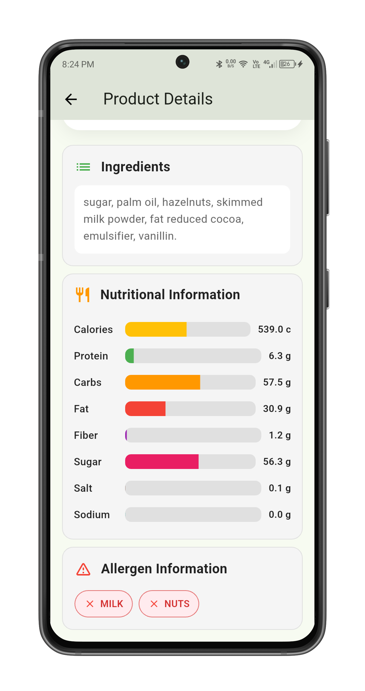

# Healthy Scan

<p align="center">
  
</p>

<p align="center">
  <b>Scan. Decode. Decide.</b><br/>
  A Flutter mobile app that turns product barcodes into clear nutrition and sustainability signals.
</p>

<p align="center">
  
  
  
  
  
</p>

---

## Why this exists

Most shoppers see a barcode. Healthy Scan sees a decision surface.

Point the camera at a product → fetch structured food data from **Open Food Facts** → surface **Nutri-Score**, **Eco-Score**, **NOVA**, macros, allergens, and ingredients in a clean product view.

Built as a production-shaped Flutter app: Firebase identity, permission-aware scanning, service-layer networking, and Provider-driven UI state.

## Features

| Area | What you get |
|------|----------------|
| Auth | Email/password + Google Sign-In via Firebase Auth |
| Scanning | Camera barcode scan with runtime permission handling |
| Product intel | Name, brand, image, quantity, ingredients, allergens |
| Scores | Nutri-Score · Eco-Score · NOVA processing group |
| Nutrition | Energy, macros, salt/sodium and related nutriments (per 100g) |
| UX | Onboarding, docked scan FAB, animated bottom nav, cached product images |
| Architecture | Views → Providers → Services → Models |

## User flow

```text
Welcome → Register / Login (Email or Google)
       → Home (NOVA / Nutri / Eco education)
       → Scan FAB → Camera → Barcode
       → Product details (scores + nutrition + ingredients)
       → Profile / Settings
```

## Showcase

Real screens from the app (portrait):

### Authentication
<table>
  <tr>
    <td align="center"></td>
    <td align="center"></td>
    <td align="center"></td>
  </tr>
</table>

### Home & Settings
<table>
  <tr>
    <td align="center"></td>
    <td align="center"></td>
  </tr>
</table>

### Product Pages
<table>
  <tr>
    <td align="center"></td>
    <td align="center"></td>
  </tr>
</table>

## Architecture

```text
┌──────────────────┐     ┌────────────────────┐     ┌─────────────────────┐
│  Views / Widgets │ ──▶ │  Providers (state) │ ──▶ │  Services / Models  │
│  screens + UI    │     │  Auth · Barcode    │     │  Dio · OFF · DTOs   │
└──────────────────┘     └────────────────────┘     └─────────────────────┘
         │                          │
         │                          ▼
         │                 Firebase Auth / Google
         ▼
   Camera + Permissions → Open Food Facts product payload
```

**Separation of concerns**
- `views/` — screens & presentational widgets
- `providers/` — auth + scan orchestration (`ChangeNotifier`)
- `service/` — HTTP product lookup (Dio → Open Food Facts)
- `modules/` — typed product / nutriment models from API JSON

## Project structure

```text
lib/
├── main.dart                 # Firebase init + MultiProvider bootstrap
├── firebase_options.dart     # FlutterFire platform config
├── modules/
│   └── product.module.dart   # ProductsModel · Product · Nutriments
├── providers/
│   ├── auth_provider.dart    # Email/password + Google Sign-In
│   └── bracode_provider.dart # Camera permission + scanner flow
├── service/
│   └── product.service.dart  # Open Food Facts API client
└── views/
    ├── screens/              # Welcome, auth, home, product, main shell
    └── widgets/              # Product header & shared UI pieces

assets/                       # Branding + onboarding imagery
showcase/                     # App screenshots for this README
android/ · ios/               # Platform projects + Firebase config
```

## Tech stack

| Layer | Choice |
|-------|--------|
| Framework | Flutter · Dart `^3.9.2` |
| Auth | `firebase_core` · `firebase_auth` · `google_sign_in` |
| State | `provider` |
| Networking | `dio` → Open Food Facts REST (`/api/v0/product/{barcode}`) |
| Scanning | `simple_barcode_scanner` · `permission_handler` |
| UI | `animated_bottom_navigation_bar` · `cached_network_image` · `icons_plus` |
| Validation | `email_validator` |

Full dependency list: [`pubspec.yaml`](pubspec.yaml)

## Open Food Facts fields used

The product service requests a focused field set (not the full dump):

`product_name` · `brands` · `quantity` · `nutriscore_grade` · `ecoscore_grade` · `ingredients_text` · `allergens_tags` · `nutriments` · `categories_tags` · `image_url` · `nova_group`

## Getting started

**Prerequisites**
- Flutter SDK (Dart 3.9+)
- Android Studio / Xcode as needed
- A Firebase project with Auth (Email + Google) enabled

```bash
git clone https://github.com/baraa404/Healthy_scan.git
cd Healthy_scan
flutter pub get
```

**Firebase**
- Confirm [`lib/firebase_options.dart`](lib/firebase_options.dart)
- Android: `android/app/google-services.json`
- iOS: `GoogleService-Info.plist` in the Runner target

**Permissions**
- Android camera entries in `AndroidManifest.xml`
- iOS camera usage string in `ios/Runner/Info.plist`

**Run**

```bash
flutter devices
flutter run -d android   # or ios / chrome / linux / macos / windows
```

## Useful commands

```bash
flutter clean && flutter pub get
flutter analyze
flutter test
```

## Notes for reviewers

- Package name in `pubspec.yaml` is still `depi_project` (original course/project id); product branding is **Healthy Scan**.
- Client Firebase config is expected for Flutter apps; do not commit private server secrets.
- Camera scanning is best validated on a **physical device**.

## License

Personal / portfolio project. Reach out if you want to reuse or extend it.
